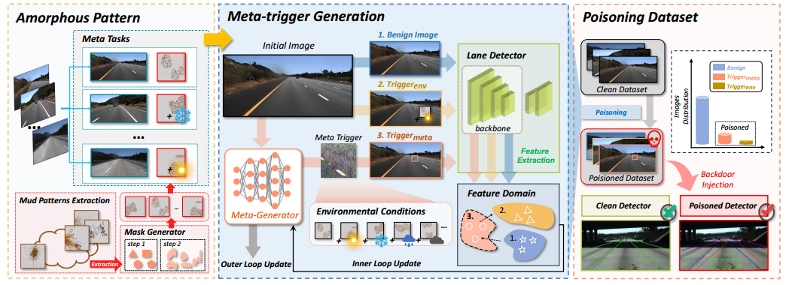

# Towards Robust Physical-world Backdoor Attacks on Lane Detection

## Introduction

This repository is the official PyTorch implemetation of paper "Towards Robust Physical-world Backdoor Attacks on Lane Detection".



## Install

### Requirements

* Python ==3.8.18

* PyTorch ==2.1.2

```shell
pip install -r requirements.txt
```

#### Data Preparation

It's necessary to prepare the dataset for the lane detection task to be poisoned, currently our project supports two types of datasets: [TuSimple](https://github.com/TuSimple/tusimple-benchmark/tree/master/doc/lane_detection) and [CULane](https://xingangpan.github.io/projects/CULane.html).

##### TuSimple 

The data should look like this:

```
dataset_root
|-- train_set
	|……
|-- test_set
	|……
|-- test_label.json
```

##### CULane

The data should look like this:

```
dataset_root
|-- driver_23_30frame
	|……
|-- driver_37_30frame
	|……
|……
```

#### Clean Lane Detection Model Preparation

Prepare the pre-trained clean lane detection model to serve as the teacher model. You can get or train them from: [LaneATT](https://github.com/lucastabelini/LaneATT), [UFLD](https://github.com/cfzd/Ultra-Fast-Lane-Detection-v2), [PolyLaneNet](https://github.com/lucastabelini/PolyLaneNet), [RESA](https://github.com/ZJULearning/resa/tree/main).

You can place it in the `model_weights` folder.

## Usage

### Generate meta-tasks using amorphous pattern

Taking the TuSimple dataset and LaneATT model as examples.

```shell
cd scripts

# edit tusimple_gendata.sh, replace the content in {}
###
cd ../data
python data_prehandle.py \
  --mode train \
  --dataset tusimple \
  --dataroot {your tusimple train dataset path} \
  --task_num 10 \
  --config_path ../models/laneatt/laneatt_tusimple_resnet34.yml \
  --checkpoint_path {your clean LD model checkpoint path} \
  --shuffle \
  --attack_method pgd --batch_size 64 \
  --model laneatt --eps 0.2 --view
###

# run
sh tusimple_gendata.sh
```

The output will be saved in `data/laneatt/xxx` 

### Pretrain the meta-generator

Before meta-training, we need to pre-train the generator using the obtained meta-tasks.

```shell
cd scripts

# edit tusimple_pretrain.sh, replace the content in {}

# run
sh tusimple_pretrain.sh
```

### Meta-training

Using the pre-trained meta-generator and meta-tasks, we can start the meta-training.

```shell
cd scripts

# edit tusimple_metatrain.sh, replace the content in {}

# run
sh tusimple_metatrain.sh
```

### Generate poisoned train dataset

After that, we can choose a poisoning rate and take out a portion from the clean dataset, using the trained meta-generator to construct a poisoned training dataset. Then, modify the poisoned lane line label files according to the specified attack strategy. By replacing this portion of data in the clean dataset, we can obtain the complete poisoned dataset.

```shell
cd gen_poisoned_dataset

# edit tusimple_gendata.sh, replace the content in {}
###
p=0.1
meta_p=0.7
strategy='loa'
loa_offset=60
lra_angle=4.5
# clean tusimple label path
from_path='tusimple_clean'
# save path
to_path='tusimple_loa_poisoned'
dataset_path='{your tusimple dataset path}'
generator_path='{your meta-generator path}'
python gen.py --p=${p} \
  --meta_p=${meta_p} --strategy=${strategy} \
  --loa_offset=${loa_offset} --lra_angle=${lra_angle} --from_path=${from_path} \
  --to_path=${to_path} --dataset_path=${dataset_path} --generator_path=${generator_path}
###

# run
sh gen.sh
```

#### Parameter Description

**p**: poisoning rate

**meta_p**: the proportion of meta triggers in malicious samples

**strategy**: attack strategy ['lda', 'lsa', 'loa', 'lra']

**loa_offset**: attack parameter for loa

**lra_angle**: attack parameter for lra

**from_path**: clean tusimple label path

**to_path**: poisoned train dataset save path

